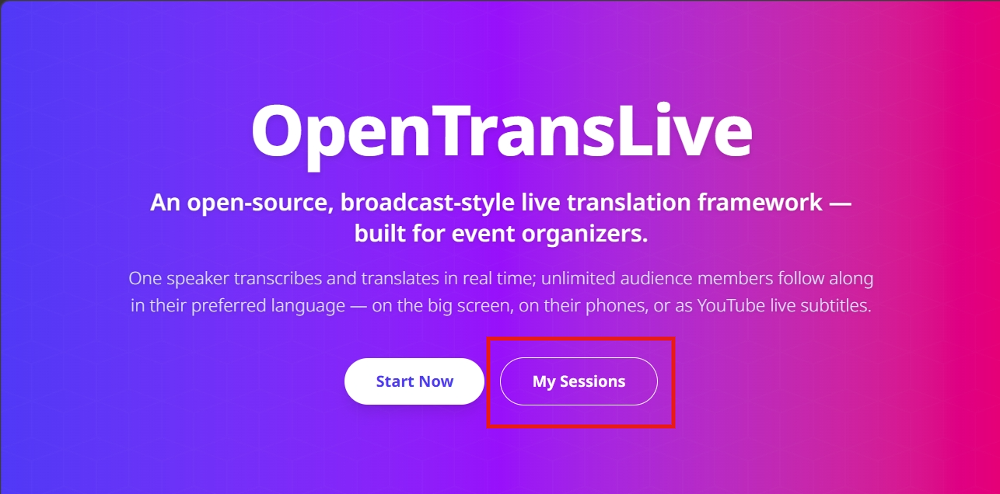
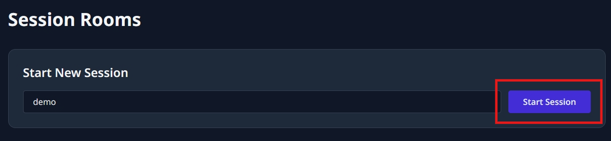
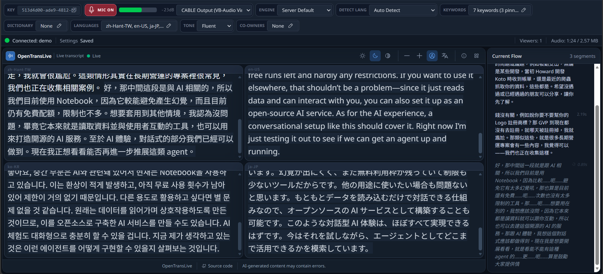
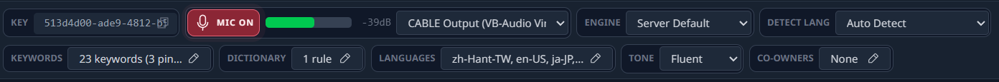
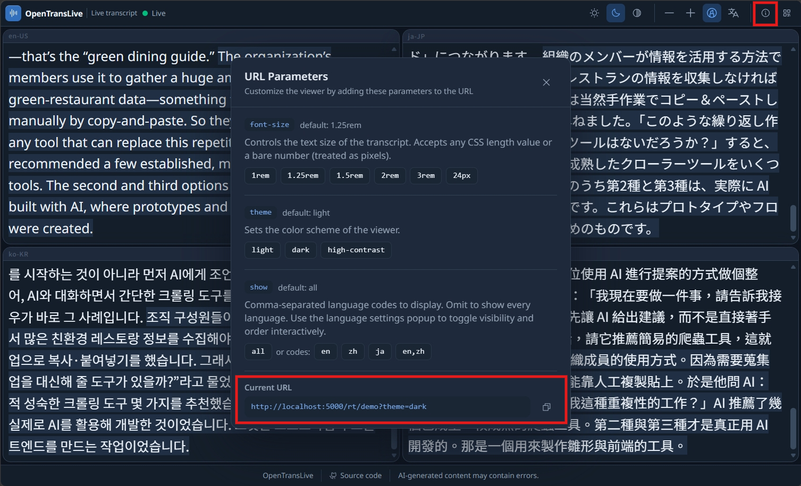

# OpenTransLive Operator Manual

This guide covers the browser workflow for running a live transcription session and sharing subtitles with an audience. For deployment, APIs, and storage details, see the [full usage guide](USAGE.en.md).

## Before you start

You need:

- An OpenTransLive organizer account.
- Realtime transcription access granted by an administrator.
- A browser with microphone permission, opened from HTTPS or `localhost`.
- A session ID containing 4–64 letters, numbers, hyphens, or underscores.

Audience members do not need an account.

## 1. Sign in and open My Sessions

1. Open your OpenTransLive site.
2. Select **Login**, enter your email address, and verify the six-digit code sent to you.
3. Select **My Sessions** on the home page.



If the home page shows **Login** instead of **My Sessions**, sign in first.

## 2. Create or reopen a session

Under **Start New Session**, enter a session ID and select **Start Session**.



The session ID becomes part of the public viewer URL, so use a short, recognizable value without private information. Starting a new ID creates the session and opens its panel.

Existing sessions appear below the form:

- **Panel** reopens the live control panel.
- **Edit** opens saved subtitle segments for correction and export.
- **Delete** releases a session you own. It does not appear for co-owned sessions.

## 3. Configure the panel

The panel combines session controls, a preview of the public transcript, and the current transcription flow.



Wait for the green **Connected** indicator before starting. Changes to panel settings save automatically; check the settings status beside the connection indicator before going live.

### Panel controls



| Control | What it does |
|---|---|
| **Key** | Copies the session key used by external broadcast clients. Do not include it in a public viewer link. |
| **Mic** | Starts or stops browser-microphone transcription. While active, the level meter shows the incoming signal. |
| **Audio device** | Selects the microphone, mixer, or virtual audio cable to send. |
| **Engine** | Chooses **Server Default**, **ElevenLabs Scribe**, or **Gemini Transcribe**. |
| **Detect Lang** | Sets the spoken language for the selected engine. Use **Auto Detect** when the source language is not fixed. Changing the engine resets this setting. |
| **Keywords** | Adds names, jargon, and event-specific phrases. Pin important entries so automatic keyword rotation does not remove them. |
| **Dictionary** | Manages a multilingual glossary and direct replacement rules. Use **Flow** replacements for the source transcript or select a language to replace translated output. |
| **Languages** | Selects target translation languages. Custom languages use BCP 47 codes such as `ja-JP`. |
| **Tone** | Sets a fluent, formal, casual, literal, or custom translation style. |
| **Co-owners** | Lets the primary owner add or remove collaborators who can operate the panel and edit settings. |

### Start the broadcast

1. Choose the transcription engine, detection language, translation languages, and audio device.
2. Add names or specialist terms under **Keywords** and **Dictionary**.
3. Select **MIC OFF** and grant microphone access when the browser asks.
4. Confirm that the button changes to **MIC ON**, the level meter moves, and new text appears in **Current Flow** and the transcript preview.
5. Open the public viewer URL in a separate browser or phone before sharing it:

   ```text
   https://<your-host>/rt/<session-id>
   ```

6. Select **MIC ON** again to stop transcription when the event ends. Wait until the button returns to **MIC OFF** before closing the panel.

The status bar shows the current viewer count and the amount of audio sent during the session.

## 4. Share and customize the viewer

The realtime viewer is public and updates automatically:

```text
https://<your-host>/rt/<session-id>
```



Viewer controls, from left to right:

| Control | What it does |
|---|---|
| Sun, moon, half-circle | Switches between light, dark, and high-contrast themes. |
| Minus and plus | Decreases or increases subtitle text size. |
| Highlighter | Enables or disables the fading highlight on older text. |
| Translate | Shows one language, all languages, or an advanced list for changing visibility and order. |
| Information | Opens URL parameters and the current shareable URL. |
| QR code | Displays a QR code for the current viewer URL. |

### Create a shareable layout

1. Adjust the theme, font size, and visible languages.
2. Select the **Information** button.
3. Review the **Current URL**. The viewer stores the chosen layout in its query parameters.
4. Copy that URL, or close the dialog and use the **QR code** button.

Available URL parameters:

| Parameter | Values | Default |
|---|---|---|
| `font-size` | Any CSS length, such as `1.5rem`, `24px`, or a bare pixel number | `1.25rem` |
| `theme` | `light`, `dark`, `high-contrast` | `light` |
| `show` | Comma-separated language codes, such as `en-US,zh-Hant-TW` | All languages |
| `fade` | Set to `0` to disable the fading highlight | Enabled |

Example:

```text
https://<your-host>/rt/demo?theme=dark&font-size=2rem&show=en-US,zh-Hant-TW
```

Changing controls in the viewer updates its current URL, so copy the URL after making all changes.

### YouTube-synchronized subtitles

Use the following page when the session ID is also the YouTube video ID and the server has YouTube integration configured:

```text
https://<your-host>/yt/<youtube-video-id>
```

Use the **Offset** control on that page if the subtitles lead or lag behind the video.

## 5. Edit and export after the event

1. Return to **My Sessions**.
2. Select **Edit** beside the session.
3. Correct translated text or delete unwanted segments. Saved edits persist to the database; reload an open viewer to display them.
4. Select **Download JSON** for the full session, or an **SRT** button for one language.

An SRT export contains only segments that have output for the selected language.

## Troubleshooting

### The microphone controls are missing

- Ask an administrator to grant your account realtime transcription access.
- Reload the panel after the permission changes.

### The browser cannot use the microphone

- Allow microphone access in the browser.
- Use HTTPS or `localhost`; browsers block microphone capture on an insecure remote origin.
- Confirm that the correct audio device is selected and its level meter moves.

### The panel is connected but no subtitles appear

- Confirm that **MIC ON** is visible.
- Verify that the selected engine is configured on the server.
- Check that speech reaches the selected audio device.
- Try **Auto Detect** or select the correct spoken language.

### Names or terminology are wrong

- Add likely spellings under **Keywords**.
- Pin terms that must remain available throughout the event.
- Add multilingual spellings to the **Dictionary** glossary.
- Add a replacement rule only when text must always change in the same way.

### The public viewer is empty

- Confirm that the viewer URL uses the same session ID as the panel.
- Confirm that the panel is connected and the microphone is on.
- Test the viewer in a separate browser window.
- If old subtitles appear but new ones do not, ask the server operator to check the realtime stream and Redis connection.

## Related documentation

- [Full usage guide](USAGE.en.md): roles, URLs, APIs, storage, and detailed troubleshooting
- [Server configuration](../live_server/README.en.md): installation and provider settings
