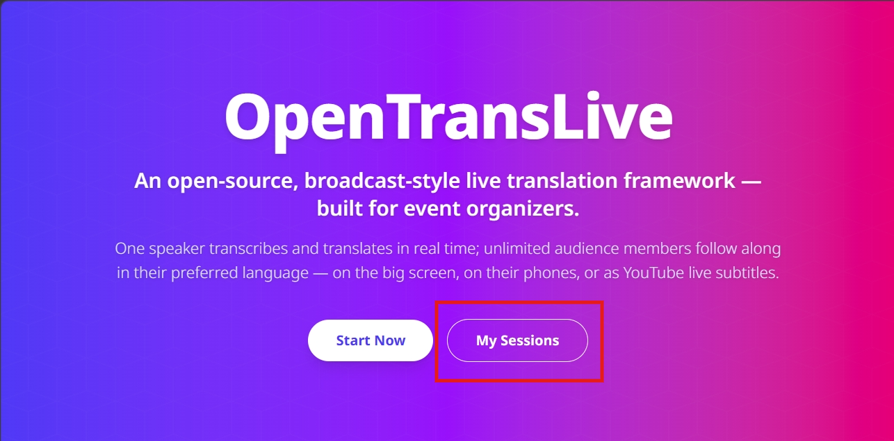
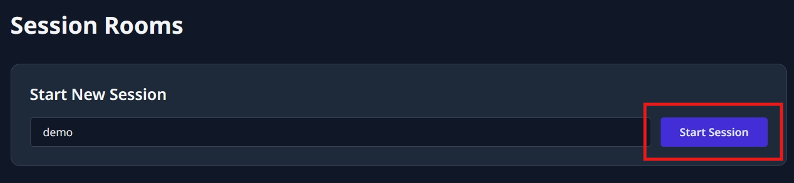
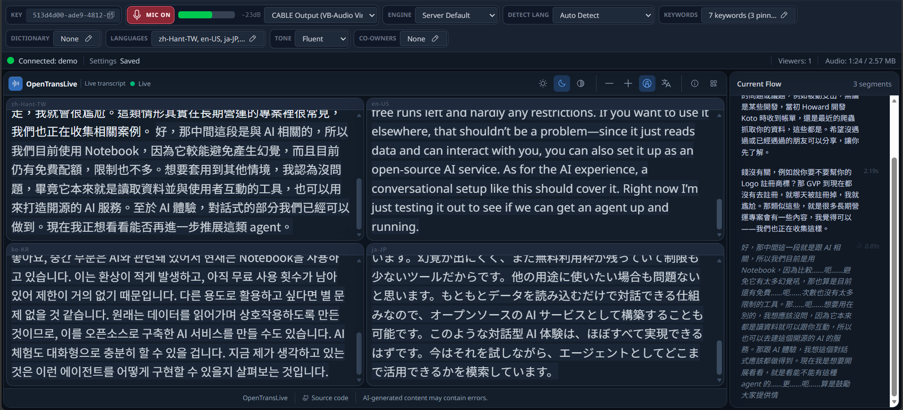
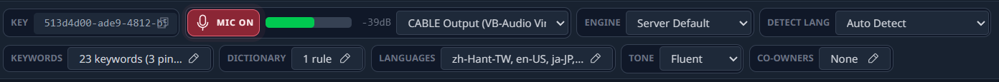
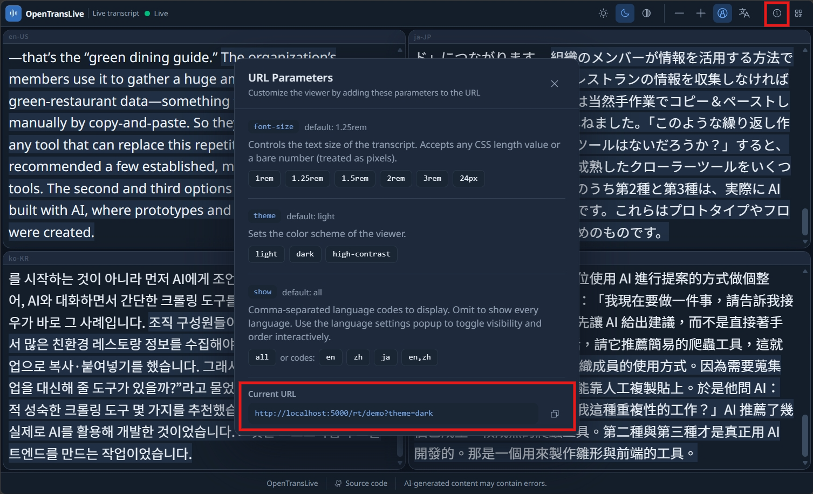

# OpenTransLive 圖解操作手冊

本手冊說明如何在瀏覽器中開設即時轉錄 session，並把字幕分享給觀眾。部署、API 與資料儲存細節請看[使用手冊](USAGE.md)。

語言：繁體中文（[English](MANUAL.en.md)）

> 介面目前只有英文，本手冊中的按鈕與欄位名稱保留英文原文（以粗體標示），方便對照畫面。

## 開始之前

你需要：

- 一個 OpenTransLive 主辦方帳號。
- 由系統管理員開通的即時轉錄權限。
- 允許使用麥克風的瀏覽器，且網站透過 HTTPS 或 `localhost` 開啟。
- 一個 session ID：4–64 個字元，只能包含英文字母、數字、連字號（`-`）或底線（`_`）。

觀眾不需要帳號。

## 1. 登入並開啟 My Sessions

1. 開啟你的 OpenTransLive 網站。
2. 點選 **Login**，輸入 email，再輸入寄到信箱的六位數驗證碼。
3. 在首頁點選 **My Sessions**。



如果首頁顯示的是 **Login** 而不是 **My Sessions**，代表尚未登入，請先登入。

## 2. 建立或重新開啟 session

在 **Start New Session** 輸入 session ID，點選 **Start Session**。



Session ID 會出現在公開的觀眾網址中，請使用簡短、好辨認且不含私人資訊的名稱。輸入新的 ID 會建立 session 並直接開啟它的 panel。

既有的 session 會列在表單下方：

- **Panel**：重新開啟即時控制台。
- **Edit**：開啟已儲存的字幕片段，進行修正與匯出。
- **Delete**：釋放你擁有的 session。co-owner 身分的 session 不會顯示這個按鈕。

## 3. 設定 panel

Panel 整合了 session 控制項、公開字幕預覽，以及目前的轉錄流程（Current Flow）。



開始前請等待綠色的 **Connected** 指示燈亮起。Panel 設定變更會自動儲存；正式開播前，請確認連線指示燈旁的設定儲存狀態。

### Panel 控制項



| 控制項 | 功能 |
|---|---|
| **Key** | 複製給外部廣播 client 使用的 session key。請勿放進公開的觀眾連結。 |
| **Mic** | 開始或停止瀏覽器麥克風轉錄。啟用時，音量表會顯示輸入訊號。 |
| **Audio device** | 選擇要送出的麥克風、混音器或虛擬音訊線。 |
| **Engine** | 選擇 **Server Default**、**ElevenLabs Scribe** 或 **Gemini Transcribe**。 |
| **Detect Lang** | 設定所選引擎的語音語言。來源語言不固定時請用 **Auto Detect**。切換引擎會重設此設定。 |
| **Keywords** | 加入人名、專有名詞與活動相關詞彙。重要詞彙請釘選（pin），避免被自動關鍵字輪替移除。 |
| **Dictionary** | 管理多語詞彙表與直接取代規則。**Flow** 取代規則作用於原文轉錄；選擇特定語言則作用於該語言的翻譯結果。 |
| **Languages** | 選擇翻譯目標語言。自訂語言請使用 BCP 47 代碼，例如 `ja-JP`。 |
| **Tone** | 設定翻譯風格：流暢（fluent）、正式（formal）、口語（casual）、直譯（literal）或自訂。 |
| **Co-owners** | 主要擁有者可新增或移除協作者；協作者可以操作 panel 並修改設定。 |

### 開始轉播

1. 選擇轉錄引擎、偵測語言、翻譯語言與音訊裝置。
2. 在 **Keywords** 與 **Dictionary** 加入人名或專業術語。
3. 點選 **MIC OFF**，並在瀏覽器詢問時允許使用麥克風。
4. 確認按鈕變成 **MIC ON**、音量表有跳動，且 **Current Flow** 與字幕預覽出現新的文字。
5. 分享前，先用另一個瀏覽器或手機開啟公開觀眾網址確認：

   ```text
   https://<your-host>/rt/<session-id>
   ```

6. 活動結束時再點一次 **MIC ON** 停止轉錄。等按鈕變回 **MIC OFF** 後再關閉 panel。

狀態列會顯示目前觀眾人數，以及本次 session 已送出的音訊量。

## 4. 分享與自訂觀眾頁

即時觀眾頁公開、免登入，並會自動更新：

```text
https://<your-host>/rt/<session-id>
```



觀眾頁控制項（由左至右）：

| 控制項 | 功能 |
|---|---|
| 太陽、月亮、半圓圖示 | 切換淺色、深色與高對比主題。 |
| 減號與加號 | 縮小或放大字幕文字。 |
| 螢光筆 | 開啟或關閉舊文字的漸淡強調效果。 |
| 翻譯 | 顯示單一語言、所有語言，或開啟進階清單調整語言的顯示與順序。 |
| 資訊 | 開啟 URL 參數說明與目前可分享的網址。 |
| QR code | 顯示目前觀眾網址的 QR code。 |

### 建立可分享的版面

1. 調整主題、字體大小與要顯示的語言。
2. 點選 **資訊** 按鈕。
3. 檢查 **Current URL**。觀眾頁會把目前的版面設定存進網址的 query 參數。
4. 複製該網址，或關閉對話框後使用 **QR code** 按鈕分享。

可用的 URL 參數：

| 參數 | 值 | 預設 |
|---|---|---|
| `font-size` | 任何 CSS 長度，例如 `1.5rem`、`24px`，或不帶單位的像素數字 | `1.25rem` |
| `theme` | `light`、`dark`、`high-contrast` | `light` |
| `show` | 以逗號分隔的語言代碼，例如 `en-US,zh-Hant-TW` | 所有語言 |
| `fade` | 設為 `0` 關閉漸淡強調效果 | 開啟 |

範例：

```text
https://<your-host>/rt/demo?theme=dark&font-size=2rem&show=en-US,zh-Hant-TW
```

在觀眾頁調整控制項會同步更新目前網址，請在所有設定調整完成後再複製網址。

### YouTube 同步字幕

當 session ID 與 YouTube 影片 ID 相同，且伺服器已設定 YouTube 整合時，可使用以下頁面：

```text
https://<your-host>/yt/<youtube-video-id>
```

若字幕比影片提早或延遲，請用該頁面的 **Offset** 控制項調整。

## 5. 活動後編輯與匯出

1. 回到 **My Sessions**。
2. 點選該 session 旁的 **Edit**。
3. 修正翻譯文字或刪除不需要的片段。編輯會存入資料庫；已開啟的觀眾頁需重新整理才會顯示修改。
4. 點選 **Download JSON** 下載完整 session，或點選某個語言的 **SRT** 按鈕下載單一語言字幕。

SRT 只會包含該語言有輸出內容的片段。

## 疑難排解

### 看不到麥克風控制項

- 請系統管理員為你的帳號開通即時轉錄權限。
- 權限變更後重新整理 panel。

### 瀏覽器無法使用麥克風

- 在瀏覽器中允許麥克風存取。
- 使用 HTTPS 或 `localhost`；瀏覽器會封鎖非安全遠端來源的麥克風擷取。
- 確認選對音訊裝置，且音量表有跳動。

### Panel 已連線但沒有字幕

- 確認按鈕顯示 **MIC ON**。
- 確認所選引擎已在伺服器上設定。
- 確認語音有送進所選的音訊裝置。
- 改用 **Auto Detect**，或選擇正確的語音語言。

### 人名或術語辨識錯誤

- 在 **Keywords** 加入可能的拼寫。
- 釘選整場活動都必須保留的詞彙。
- 在 **Dictionary** 詞彙表加入多語拼寫。
- 只有在文字必須每次都以相同方式修改時，才加入取代規則。

### 公開觀眾頁是空的

- 確認觀眾網址的 session ID 與 panel 相同。
- 確認 panel 已連線且麥克風已開啟。
- 用另一個瀏覽器視窗測試觀眾頁。
- 若舊字幕有出現但新字幕沒有，請伺服器維運人員檢查即時串流與 Redis 連線。

## 相關文件

- [使用手冊](USAGE.md)：角色、網址、API、資料儲存與詳細疑難排解
- [伺服器設定](../live_server/README.md)：安裝與 provider 設定
